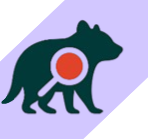

## À propos

Formation RNCP 6 - **Concepteur Développeur d'applications** (bac +3/4) @ [Simplon](https://simplon.co)  
Alternance **Ingénieure en développement** @ [Neoledge](https://www.neoledge.com) · Lille  
Basée à Lille - Tourcoing

## Stack

  

## Projets

<table>
  <tr>
    <td width="220">
      
    </td>
    <td valign="middle">
      <h3>DogFriendly</h3>
      
Projet de fin de formation RNCP 5 - Développeur web & web mobile (bac+2) 
      Plateforme pour trouver des lieux dog-friendly autour de vous. 
      Stack : <strong>C# · .NET · Vue.js · Docker</strong>

      <a href="https://github.com/ChSPN/DogFriendly">Voir le projet →</a>
    </td>
  </tr>
  <tr><td colspan="2" height="12"></td></tr>
  <tr>
    <td width="220">
      
    </td>
    <td valign="middle">
      <h3>TrApp </h3>
      
Projet de fin de formation RNCP 6 - Concepteur développeur d'applications (bac+3/4) 
      Application de collecte de données terrain pour chercheurs & scientifiques. 
      Stack prévue : <strong>C# · .NET MAUI</strong>

      <a href="https://github.com/ChSPN/TrApp">Voir le projet →</a>
    </td>
  </tr>
</table>

### Envie d'échanger ou de collaborer ?

